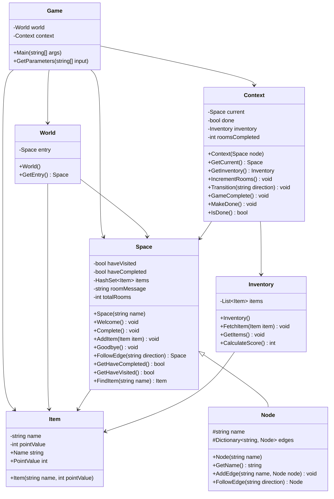

# 1.-Semesterprojekt
Læringsspil baseret på World of Zuul

### UML Diagram

```mermaid
classDiagram
    class Game {
        -World world
        -Context context
        +Main(string[] args)
        +GetParameters(string[] input)
    }

    class World {
        -Space entry
        +World()
        +GetEntry() Space
    }

    class Context {
        -Space current
        -bool done
        -Inventory inventory
        -int roomsCompleted
        +Context(Space node)
        +GetCurrent() Space
        +GetInventory() Inventory
        +IncrementRooms() void
        +Transition(string direction) void
        +GameComplete() void
        +MakeDone() void
        +IsDone() bool
    }

    class Space {
        -bool haveVisited
        -bool haveCompleted
        -HashSet~Item~ items
        -string roomMessage
        -int totalRooms
        +Space(string name)
        +Welcome() void
        +Complete() void
        +AddItem(Item item) void
        +Goodbye() void
        +FollowEdge(string direction) Space
        +GetHaveCompleted() bool
        +GetHaveVisited() bool
        +FindItem(string name) Item
    }

    class Inventory {
        -List~Item~ items
        +Inventory()
        +FetchItem(Item item) void
        +GetItems() void
        +CalculateScore() int
    }

    class Node {
        #string name
        #Dictionary~string, Node~ edges
        +Node(string name)
        +GetName() string
        +AddEdge(string name, Node node) void
        +FollowEdge(string direction) Node
    }

    class Item {
        -string name
        -int pointValue
        +Name string
        +PointValue int
        +Item(string name, int pointValue)
    }

    Game --> World
    Game --> Context
    Game --> Space
    Game --> Item
    World --> Space
    World --> Item
    Context --> Space
    Context --> Inventory
    Space --> Item
    Inventory --> Item
    Space <|-- Node

```

